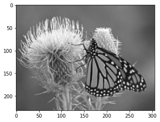

<div class="cell markdown" id="ONf1qRd1K7J7">

# Colourization_of_Grayscale_Images


This Deep Learning Project's objective is to utilize Python to add colour to grayscale images. 
The process of image colourization involves converting a black and white image into a coloured image. This is achieved by employing a deep neural network using OpenCV.

</div>

<div class="cell markdown" id="pasjVk5WRXMM">

[](https://github.com/Karunya003/Colourization_of_Grayscale_Images/assets/85503646/7be70b5e-6d3f-4eb7-9be6-1d3ec1a5188d)

</div>


<div class="cell markdown" id="Tb-GeIj8Nl6Y">

### Lab Color Space:

Similar to RGB, Lab is another color space consisting of three channels:

    L channel: This channel represents the Lightness
    a channel: This channel represents green-red
    b channel: This channel represents blue-yellow


In the Lab color space, the grayscale portion of the image is exclusively encoded in the L channel. Consequently, for this project, the Lab color space is preferred as it allows us to separate and manipulate the color and brightness information effectively.
</div>

<div class="cell markdown" id="t25jOjTGNpQf">

### Problem Statement:

deep learning project colourize grayscale images with python

This deep learning project focuses on colourizing black and white images using Python. The problem statement can be framed as follows: predicting the 'a' and 'b' channels of an image when provided with a grayscale input image.

For this project, the OpenCV DNN (Deep Neural Network) architecture is employed, which has been trained on the ImageNet dataset. The neural network is trained using the 'L' channel of images as input data, with the 'a' and 'b' channels serving as the target data.

</div>

<div class="cell markdown" id="JF04ygEWN1Dg">

#### Steps to implement Image Colorization Project:

To achieve the task of colorizing black and white images, we will utilize a pre-trained Caffe model along with two important files:

  **Caffe Model:** This is a pre-trained deep neural network model specifically designed for colourization tasks. It contains the architecture and weights learned from extensive training on a large dataset.

  **Prototxt File:** The prototxt file (short for prototype text file) defines the network architecture. It specifies the structure of the neural network, including the layers, their connectivity, and parameters. This file acts as a blueprint for constructing the neural network.

  **NumPy File:** This NumPy file stores cluster center points in a format compatible with NumPy, a popular Python library for numerical operations. These cluster center points are used during the colorization             process, often in techniques like k-means clustering for mapping grayscale values to colour values.

1.  Make a directory with name models.

</div>

<div class="cell code" data-execution_count="1" id="iyWZYzh65gX2">

``` python
!mkdir models
```

</div>

<div class="cell markdown" id="aTQIFk1MN8-U">

download the caffemodel, prototxt file and the NumPy file.

</div>

<div class="cell code" data-execution_count="3" data-colab="{&quot;base_uri&quot;:&quot;https://localhost:8080/&quot;}" id="lE0XfKuP5kZd" data-outputId="4d70b345-f785-43b1-9d29-88f4c482f8ed">

``` python
!wget https://github.com/richzhang/colorization/blob/caffe/colorization/resources/pts_in_hull.npy?raw=true -O ./pts_in_hull.npy
```

</div>

<div class="cell code" data-execution_count="4" data-colab="{&quot;base_uri&quot;:&quot;https://localhost:8080/&quot;}" id="fLpvCltE5u72" data-outputId="567f403e-e26c-4bfd-9c06-c938b5ba4743">

``` python
!wget https://raw.githubusercontent.com/richzhang/colorization/caffe/colorization/models/colorization_deploy_v2.prototxt -O ./models/colorization_deploy_v2.prototxt
```


</div>

<div class="cell code" data-execution_count="5" data-colab="{&quot;base_uri&quot;:&quot;https://localhost:8080/&quot;}" id="OmIJf0BI7acl" data-outputId="ad130ef0-f3bf-4730-c9af-415d9831c25f">

``` python
!wget http://eecs.berkeley.edu/~rich.zhang/projects/2016_colorization/files/demo_v2/colorization_release_v2.caffemodel -O ./models/colorization_release_v2.caffemodel
```

</div>

<div class="cell markdown" id="hu-I5bAeOCHp">

### Import Essential Library

</div>

<div class="cell code" data-execution_count="12" id="RUWZq8Sq7g4m">

``` python
import numpy as np
import cv2 as cv
from matplotlib import pyplot as plt
import os.path
```

</div>

<div class="cell markdown" id="lwURjJ_IOFyk">

### Read Grayscale image and load the caffemodel:

</div>

<div class="cell code" data-execution_count="14" data-colab="{&quot;height&quot;:269,&quot;base_uri&quot;:&quot;https://localhost:8080/&quot;}" id="qm-fStTe7ybo" data-outputId="a2542c6b-f748-4ad1-9313-149c8b3cf28c">

``` python
frame = cv.imread("new.jpg")

numpy_file = np.load('./pts_in_hull.npy')
Caffe_net = cv.dnn.readNetFromCaffe("./models/colorization_deploy_v2.prototxt", "./models/colorization_release_v2.caffemodel")


rgb_img = cv.cvtColor(frame, cv.COLOR_BGR2RGB)		# this converts it into RGB
plt.imshow(rgb_img)
plt.show()
```

<div class="output display_data">



</div>

</div>

<div class="cell markdown" id="qgVEsYfxONnb">

### Add layers to the caffe model:

</div>

<div class="cell code" data-execution_count="9" id="f-UAR2AS72yi">

``` python
numpy_file = numpy_file.transpose().reshape(2, 313, 1, 1)
Caffe_net.getLayer(Caffe_net.getLayerId('class8_ab')).blobs = [numpy_file.astype(np.float32)]
Caffe_net.getLayer(Caffe_net.getLayerId('conv8_313_rh')).blobs = [np.full([1, 313], 2.606, np.float32)]
```

</div>

<div class="cell markdown" id="jxty2X4BORrv">

### Extract L channel and resize it:

</div>

<div class="cell code" data-execution_count="10" id="r4UdVyYx8l8N">

``` python
input_width = 224
input_height = 224

rgb_img = (frame[:,:,[2, 1, 0]] * 1.0 / 255).astype(np.float32)
lab_img = cv.cvtColor(rgb_img, cv.COLOR_RGB2Lab)
l_channel = lab_img[:,:,0] 

l_channel_resize = cv.resize(l_channel, (input_width, input_height)) 
l_channel_resize -= 50
```

</div>

<div class="cell markdown" id="KhrO4zrIOWPA">

### Predict the ab channel:

</div>

<div class="cell code" data-execution_count="11" data-colab="{&quot;base_uri&quot;:&quot;https://localhost:8080/&quot;}" id="Quh9YGtL8oR5" data-outputId="450a4077-e0cb-4f13-e308-68977d7073e9">

``` python
Caffe_net.setInput(cv.dnn.blobFromImage(l_channel_resize))
ab_channel = Caffe_net.forward()[0,:,:,:].transpose((1,2,0)) 

(original_height,original_width) = rgb_img.shape[:2] 
ab_channel_us = cv.resize(ab_channel, (original_width, original_height))
lab_output = np.concatenate((l_channel[:,:,np.newaxis],ab_channel_us),axis=2) 
bgr_output = np.clip(cv.cvtColor(lab_output, cv.COLOR_Lab2BGR), 0, 1)

cv.imwrite("./result.png", (bgr_output*255).astype(np.uint8))
```

</div>

</div>
